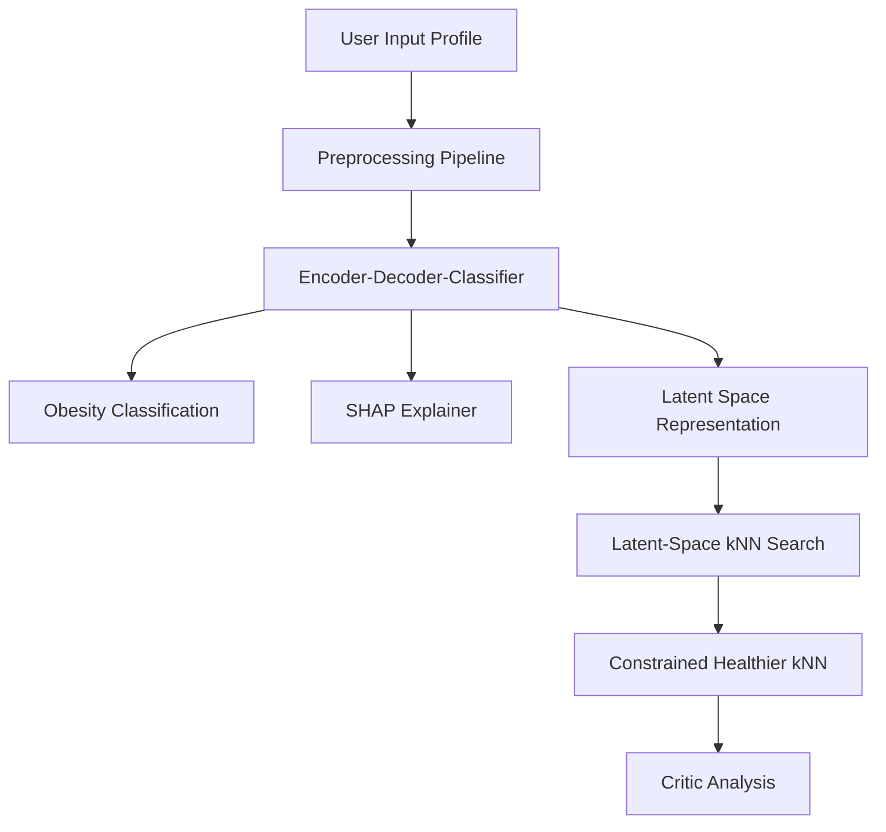
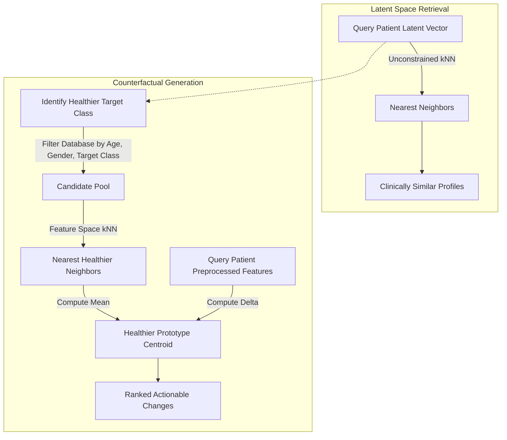

  <h1 align="center">Clinical Counterfactual Risk Explorer</h1>

## Description

The Clinical Counterfactual Risk Explorer is a clinical decision-support tool designed for interpretable obesity-level prediction. It utilizes a custom Encoder-Decoder-Classifier neural network to classify a patient's obesity level while simultaneously learning a structured latent representation. This latent space enables the retrieval of clinically similar patients and the identification of "healthier prototypes"—real patient profiles that are one severity step closer to normal weight. By comparing a patient to their healthier prototype, the system generates actionable counterfactual recommendations, indicating the specific lifestyle changes required to achieve a healthier profile.

---

## Key Features

| Feature | Description |
|---|---|
| **Encoder-Decoder-Classifier** | A joint autoencoder and classification model that learns a compact 16-dimensional latent representation of patient health metrics. |
| **Latent-Space kNN** | Retrieves the five most comparable patient profiles using Euclidean distance within the learned latent space. |
| **Constrained Counterfactual Search** | Performs a demographic-matched search to identify patients positioned one severity class healthier. |
| **Critic Analysis** | Computes actionable feature shifts required to transition a patient profile toward a healthier prototype. |
| **SHAP Explainability** | Provides model-agnostic feature attribution to elucidate the primary factors driving the classification. |
| **Role-Based Access Control** | The application implements a basic login system with SHA-256 password hashing. **Doctors** have full access to predictions, SHAP, similar patient profiles (latent kNN), healthier prototype tables, and critic recommendations. **Patients** have access restricted to predictions, SHAP explanations, and the final recommended changes. |
| **Interactive UI** | Form-based input, probability tables, and recommendation panels presented via a web interface. |

---

## Architecture

### High-Level System Overview

### Counterfactual kNN Logic

---

## Dataset

The project uses the [Estimation of Obesity Levels Based on Eating Habits and Physical Condition](https://archive.ics.uci.edu/dataset/544) dataset from the UCI Machine Learning Repository. It contains 2,111 patient records with 16 features relating to demographics, eating habits, and physical condition, mapped to 7 distinct obesity severity levels.

---

## Results

Pre-generated result PDFs are available in the `results/` folder, showcasing predictions for different obesity classes from both the doctor and patient perspectives:

- **Doctor view**: `doctor_normal.pdf`, `doctor_obesityI.pdf`, `doctor_overweightI.pdf`, `doctor_overweightII.pdf`, `doctor_underweight.pdf`
- **Patient view**: `patient_normal.pdf`, `patient_obesityI.pdf`, `patient_overweightI.pdf`, `patient_overweightII.pdf`, `patient_underweight.pdf`

---

## How to run?

Check [working.md](working.md) to run the project.

Additionally, check [methodology.md](methodology.md) to understand about the terminologies and techniques in detail.

## Disclaimer

> The predictions are based on specific training data and can be incorrect. This app is aimed to help clinicians and assist them, not replace them. Regardless of the outcome, it is always advised to consult a doctor.

